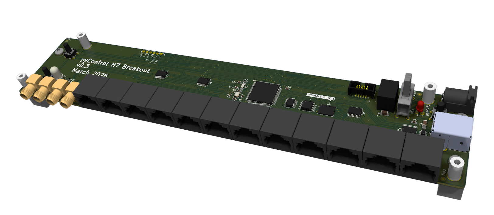
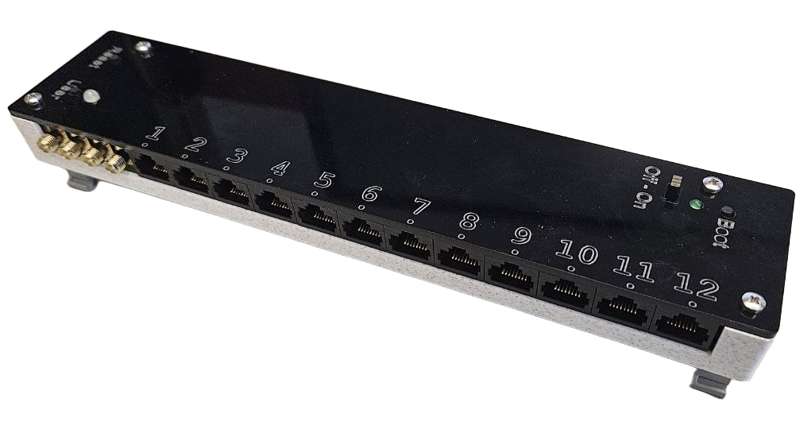
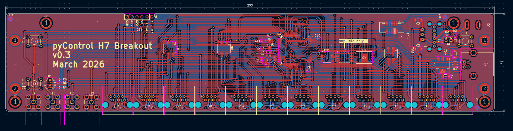
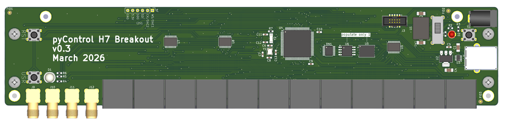
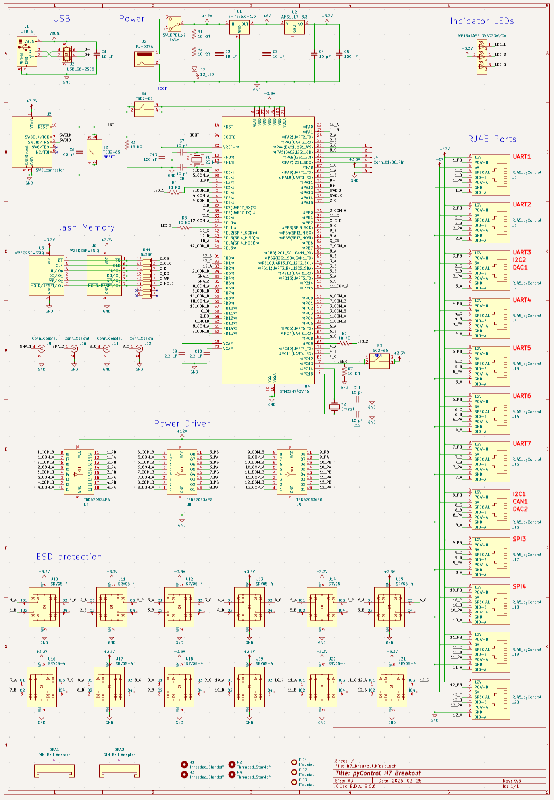

# pyControl H7 Breakout

> This is a work in progress. Please see the discussion at https://github.com/orgs/pyControl/discussions/171#discussion-9756734

A pyControl breakout board using an [STM32H743VIT6](https://www.digikey.com/short/7n8h83wr) microcontroller.

- 480 MHz Cortex-M7, 800 KB SRAM, 32 MB QSPI flash
- 12 pyControl RJ45 behavior ports with ESD protection on all DIO_A, DIO_B, and DIO_C pins
- 4 SMA connectors
- USB-B connector with ESD protection
- On/off switch, user button, reset button, and boot button for bootloader access
- Power indicator LED, controllable RGB LED for status indication
- Easy to manufacture case design
- Mounting hole spacing compatible with [DIN adapters](https://www.digikey.com/short/h7977mfv) that securely mount onto [DIN rail](https://www.digikey.com/en/products/filter/hardware-fasteners-accessories/580?s=N4IgjCBcpgHAzFUBjKAzAhgGwM4FMAaEAeygG0QAWMeWSgThAF0iAHAFyhAGV2AnAJYA7AOYgAvkQC0AJiQhUkfgFdCJciACszcZJBzIFACIBJAHIACPhgFYQRU5eu2dQA)

