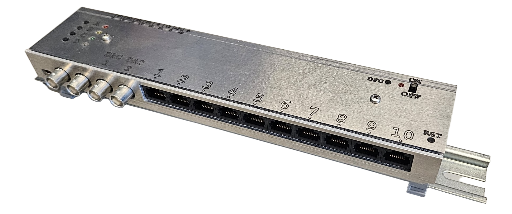
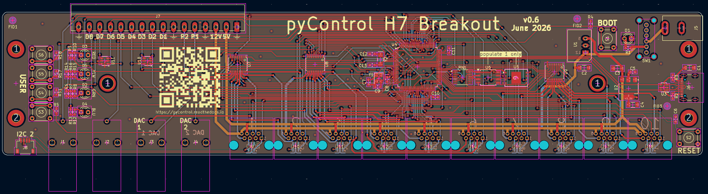
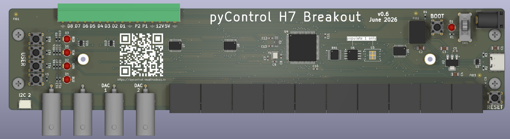
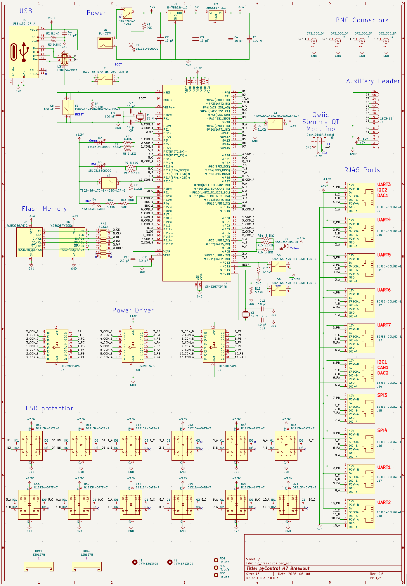

> !!! WARNING !!! This is a work in progress. Please see the [discussion](https://github.com/orgs/pyControl/discussions/171) to see updates and provide feedback.
# pyControl H7 Breakout
A pyControl breakout board using an [STM32H743VIT6](https://www.digikey.com/short/7n8h83wr) microcontroller.

- 480 MHz Cortex-M7, 800 KB SRAM, 32 MB QSPI flash
- 10 pyControl RJ45 behavior ports with ESD protection on all DIO_A, DIO_B, and DIO_C pins
- 4 BNC connectors
- 1 [QWIIC](https://www.sparkfun.com/qwiic) / [Stemma-QT](https://learn.adafruit.com/introducing-adafruit-stemma-qt/what-is-stemma-qt) / [Modulino](https://store.arduino.cc/collections/modulino) connector
- 16 position [terminal block](https://www.digikey.com/en/products/detail/phoenix-contact/1803413/260588) that pairs with a [screw terminal plug](https://www.digikey.com/en/products/detail/phoenix-contact/1803714/260543) and exposes 2 extra POW driver pins, 8 extra digital I/O pins, 5V, 12V and 4 grounds
- USB type C connector with ESD protection
- On/off switch, 4 user buttons, reset button, and a DFU button for bootloader access
- Power indicator LED, 4 user controllable LEDs (red, yellow, green and blue)
- 2 piece bent sheet metal case
- Mounting hole spacing compatible with [DIN adapters](https://www.digikey.com/short/h7977mfv) that securely mount onto [DIN rail](https://www.digikey.com/en/products/filter/hardware-fasteners-accessories/580?s=N4IgjCBcpgHAzFUBjKAzAhgGwM4FMAaEAeygG0QAWMeWSgThAF0iAHAFyhAGV2AnAJYA7AOYgAvkQC0AJiQhUkfgFdCJciACszcZJBzIFACIBJAHIACPhgFYQRU5eu2dQA)

